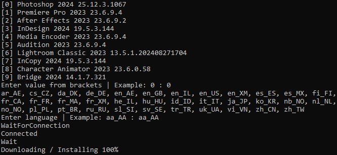

Requirement installed Creative Cloud

Example run with command
```Console
powershell -ExecutionPolicy Bypass .\main.ps1
```
or context menu Run with PowerShell



if something goes wrong during installation, you can close the Set-up.exe process and delete unnecessary temporary files in the adobeTemp and Temp folders

Microsoft Visual C++ Redistributable Packages not downloaded from the installer. if adobe app does not start, you can install them here https://learn.microsoft.com/cpp/windows/latest-supported-vc-redist

# Thanks
https://gist.github.com/ayyybe/a5f01c6f40020f9a7bc4939beeb2df1d \
[https://github.com/ckamte/adobe-packager-windows/blob/main/ccdl-win.py](https://github.com/ckamte/adobe-packager-windows/blob/b91357bfac574b072c6460add2afd2e6857ba5b0/ccdl-win.py)\
[https://github.com/TsudaKageyu/minhook](https://github.com/TsudaKageyu/minhook/tree/565968b28583221751cc2810e09ea621745fc3a3)\
IDA \
x64dbg \
Cheat Engine \
Visual Studio \
Notepad++
